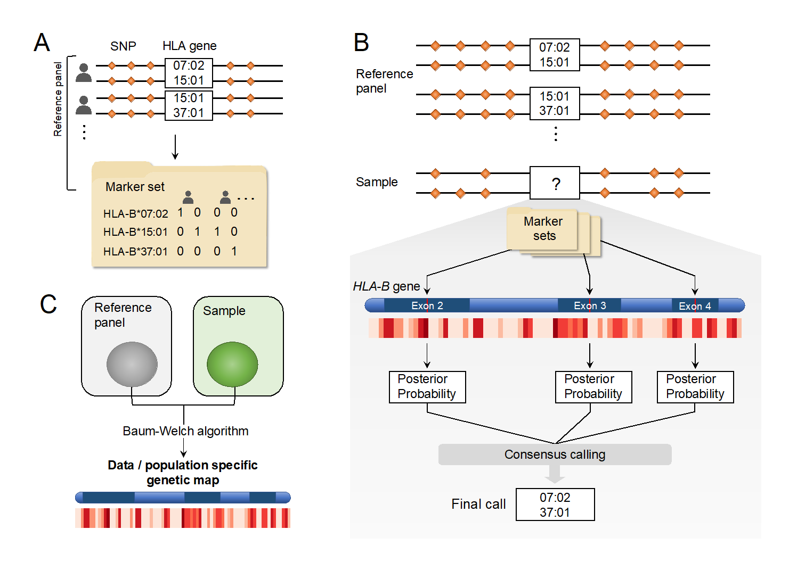

# CookHLA

## (1) Introduction

**CookHLA** is an accurate and efficient HLA imputation method.

`Human leukocyte antigen (HLA)` genes in the major histocompatibility complex (MHC) region influence many immune-related disease phenotypes. Discovering which HLA alleles or amino acids drive phenotypes often requires fine-mapping analysis in tens of thousands of samples, of which HLA typing can be prohibitively costly. Fortunately, the recent development of imputation methods enabled the prediction of HLA alleles using intergenic SNP data, allowing many studies to fine-map HLA for immune phenotypes. Nonetheless, existing imputation methods still have limitations in accuracy.

**CookHLA** substantially improved imputation accuracy over previous methods, including the predecessor SNP2HLA by implementing several changes. First, to increase accuracy and efficiency, we employed the recently released hidden Markov model (Beagle v4 and v5). Second, to further improve accuracy, we developed a procedure that can account for local variability in the exons of HLA genes. Highly polymorphic exons (exon 2/3/4 in Class I and 2/3 in Class II) are critical regions whose sequences can determine most of the 4-digit alleles. In our method, we repeat imputation by putting the marker set locally in each of the highly polymorphic exons, and use consensus posterior probabilities from the repeated analyses for final predictions(Figure B). Third, to increase accuracy even further, we adaptively learn the genetic map of MHC from the data. This map information allows us to account for the data-specific LD structure within MHC, which improves the imputation accuracy compared to the use of publicly available genetic maps(Figure C).





<br>
<br>

## (2) Requirements and Dependencies

Prepare Linux or OS X(Mac) operating system. CookHLA currently doesn't support Windows.


> CookHLA was tested in the following operating systems. Linux : Ubuntu 19.04(Disco Dingo), Ubuntu 18.04.3 LTS(Bionic Beaver), CentOS_7, Linux Mint 19.2 Cinnamon(Tina). / OS X : Catalina, Mojave


> In case of using Catalina OS X, Using default shell as 'Bash($)' not 'Zsh(%)' is recommended. To change the default shell to Bash, Please refer this blog(https://www.howtogeek.com/444596/how-to-change-the-default-shell-to-bash-in-macos-catalina/).

<br>

Then, download this project in a directory of your system. Assuming that 'git' command is already installed, 

```
$ git clone https://github.com/WansonChoi/CookHLA.git
$ cd CookHLA
```
<br>


Next external software must be prepared in 'dependency/' folder. Users have to do it themselves because of copyright issue.

- PLINK1.9b (https://www.cog-genomics.org/plink/)
- mach1 (http://csg.sph.umich.edu/abecasis/MACH/download/)
- beagle.18May20.d20.jar (http://faculty.washington.edu/browning/beagle/beagle.html - 'Download Beagle 5.1' section; **Rename it to 'Beagle5.jar'** and place it in 'dependency/' folder.)
- beagle.27Jan18.7e1.jar (https://faculty.washington.edu/browning/beagle/b4_1.html - 'Download Beagle 4.1' section; **Rename it to 'Beagle4.jar'** and place it in 'dependency/' folder.) <= only if you want to use Beagle v4 instead of v5.
- beagle2linkage.jar (https://faculty.washington.edu/browning/beagle_utilities/utilities.html - 'File conversion utilities' section)
- beagle2vcf.jar (https://faculty.washington.edu/browning/beagle_utilities/utilities.html - 'File conversion utilities' section)
- linkage2beagle.jar (https://faculty.washington.edu/browning/beagle_utilities/utilities.html - 'File conversion utilities' section)
- vcf2beagle.jar (https://faculty.washington.edu/browning/beagle_utilities/utilities.html - 'File conversion utilities' section)
- transpose.jar (https://faculty.washington.edu/browning/beagle_utilities/utilities.html - 'File manipulation utilities' section)


<br>

(**Heads-up**) After downloading Beagle4('beagle.27Jan18.7e1.jar') and Beagle5('beagle.18May20.d20.jar') in the 'dependency/' folder, don't forget to rename them as 'beagle4.jar' and 'beagle5.jar'.

<br>


The following requirements must be installed in your system.

- python>=3.6.x
- pandas>=0.25.3
- perl>=5.26.2
- R>=3.6.x
- Java
- csh(or tcsh)


There are two ways to install these required software packages. 

First, you can manually install missing package yourself. 

Second, if Python 'Anaconda(https://www.anaconda.com/)' is installed in your system, you can create an Anaconda virtual environment, which will automatically install the required packages. Specifically, you can create a new virtual environment for CookHLA with the provided YML file.

There are two YML files ('CookHLA_LINUX.yml' and 'CookHLA_OSX.yml'). Choose an appropriate one **depending on your operating system**.

```
$ conda env create -f CookHLA_OSX.yml          ## OS X(Mac)
$ conda env create -f CookHLA_LINUX.yml        ## Linux
```

The above command will generate a new Python virtual environment named 'CookHLA', which will contain required Python packages, R and R libraries, independent from your original Python system. For more detailed explanation about Anaconda's Python virtual environment managing, please check (https://docs.conda.io/projects/conda/en/latest/user-guide/tasks/manage-environments.html#create-env-file-manually).

If the new virtual environment has been successfully created, then activate it.

```
$ conda activate CookHLA
```

CookHLA can be run in this virtual environment.


<br>


> Type 'conda deactivate' on your command line if you want to go back to your original Python system setting. (https://docs.conda.io/projects/conda/en/latest/user-guide/tasks/manage-environ ments.html#deactivating-an-environment)


> (Tip) Type 'conda env remove -n CookHLA' in your command line if you want to remove this newly created virtual environment for CookHLA forever. (https://docs.conda.io/projects/conda/en/latest/user-guide/tasks/manage-environments.html#removing-an-environment)

<br>
<br>


## (3) Preparing input file

- CookHLA takes unphased SNP file as input. The input file must be in PLINK binary file format (PREFIX.bed, PREFIX.bim, PREFIX.fam). You only need to specify the PREFIX in the input argument (without file extensions).
- CookHLA uses only SNPs in chr6:29-34Mb. Thus, you can portably prepare only those SNPs in that region as input file.   
- (**Heads-Up**): Currently, CookHLA **ONLY SUPPORTS hg18** similar to SNP2HLA. Since CookHLA uses base position instead of rsID to match SNPs to reference panel, this is very important. The reason we are still using the old coordinate is because many existing SNP2HLA-formatted reference panels are in hg18. Although being suboptimal, the best way currently is to down-liftover your SNPs to hg18, obtain the imputation results, and up-liftover to your present coordinate for further analysis.


<br>
<br>


## (4) Preparing a reference panel

CookHLA requires a phased reference panel. CookHLA uses the same reference panel format as SNP2HLA. For many existing SNP2HLA-formatted panels for various populations, see section (8) below.

Or, if you want to build a reference panel yourself, you can use the **MakeReference** software that comes with SNP2HLA. The official webpage of SNP2HLA is "http://software.broadinstitute.org/mpg/snp2hla/" and the manual of **MakeReference** can be found at "http://software.broadinstitute.org/mpg/snp2hla/makereference_manual.html".


<br>
<br>


## (5) Running imputation

**Usage example**:

```
$ python CookHLA.py \
    -i example/1958BC \
    -o MyHLAImputation/1958BC+HM_CEU_REF \
    -ref example/HM_CEU_REF \
    -gm example/AGM.1958BC+HM_CEU_REF.mach_step.avg.clpsB \
    -ae example/AGM.1958BC+HM_CEU_REF.aver.erate \
    -mem 2g \
    # -mp 2   # The number of available cores for Multiprocessing.
```

- -i: Input file (Prefix of the PLINK binary formatted SNP file.)
- -o: Output file.
- -ref: Reference panel (Prefix of the SNP2HLA-formatted panel)
- -gm, -ae: Adaptive genetic map information (See the next section for how to generate these)
- -mem: memory assigned per core. 
- -mp (optional): number of cores to be used for multi-processing.


<br>
<br>


## (6) How to generate an Adaptive Genetic Map

To increase accuracy, CookHLA adaptively learns genetic map from data. To generate an Adaptive genetic map, you have to use **'MakeGeneticMap' module** in the CookHLA project folder.

```
$ python -m MakeGeneticMap \
    -i example/1958BC \
    -ref example/HM_CEU_REF \
    -o MyAGM/1958BC+HM_CEU_REF
```

This will generate (1) '\*.aver.erate' and (2) '\*.mach_step.avg.clpsB' files, each of which can be passed into '-ae' and '-gm' arguments of CookHLA respectively.

If MakeGeneticMap gives error, one possibility is that the number of SNPs in the input data is too large, particularly compared to the reference panel. In that case, you can restrict the SNPs to the overlapping SNPs with the reference first and try. (Non-overlapping SNPs are not informative for imputation anyways)


<br>
<br>


## (7) Output files and downstream analysis

In the output, '\*.alleles' file contains the imputed HLA types of the target genotype. ‘\*.hped’ file is a PLINK PED-like format of HLA allele information.

Unlike SNP2HLA, CookHLA does not directly give binary markers of the amino acid residues at every position. However, you can simply feed hped file to **HATK** (https://github.com/WansonChoi/HATK) and generate the binary markers of amino acids. HATK also provides simple association test and visualization procedure.

Citation: Choi W, Luo Y, Raychaudhuri S, Han B. HATK: HLA Analysis Toolkit [published online ahead of print, 2020 Jul 31]. Bioinformatics. 2020;btaa684. doi:10.1093/bioinformatics/btaa684


<br>
<br>


## (8) Publicly available Reference panels

The below are publicly available SNP2HLA-formatted reference panels, which are directly applicable to CookHLA.

1. T1DGC panel (European, N=5,225) – available for research purposes upon request

    - Webpage Link: http://software.broadinstitute.org/mpg/snp2hla/ - 'Links' section.
    - Citation: Jia X, Han B, Onengut-Gumuscu S, et al. Imputing amino acid polymorphisms in human leukocyte antigens. PLoS One. 2013;8(6):e64683. Published 2013 Jun 6. doi:10.1371/journal.pone.0064683

2. Korean panel (East Asian, N=413)

    - Webpage Link: https://sites.google.com/site/scbaehanyang/hla_panel
    - Citation: 
        1. Kim K, Bang SY, Lee HS, Bae SC. Construction and application of a Korean reference panel for imputing classical alleles and amino acids of human leukocyte antigen genes. PLoS One. 2014;9(11):e112546. Published 2014 Nov 14. doi:10.1371/journal.pone.0112546.
        2. Kim K, Bang SY, Yoo DH, et al. Imputing Variants in HLA-DR Beta Genes Reveals That HLA-DRB1 Is Solely Associated with Rheumatoid Arthritis and Systemic Lupus Erythematosus. PLoS One. 2016;11(2):e0150283. Published 2016 Feb 26. doi:10.1371/journal.pone.0150283.

3. Pan-Asian panel (East and South Asian, N=530)

    - Webpage Link: http://software.broadinstitute.org/mpg/snp2hla/
    - Citation: 
        1. Pillai NE, Okada Y, Saw WY, et al. Predicting HLA alleles from high-resolution SNP data in three Southeast Asian populations. Hum Mol Genet. 2014;23(16):4443-4451. doi:10.1093/hmg/ddu149,
        2.  Okada Y, Kim K, Han B, et al. Risk for ACPA-positive rheumatoid arthritis is driven by shared HLA amino acid polymorphisms in Asian and European populations. Hum Mol Genet. 2014;23(25):6916-6926. doi:10.1093/hmg/ddu387.

4. HAN Chinese panel (East Asian, N=9,773)

    - Webpage Link: http://gigadb.org/dataset/100156
    - Citation: Zhou F, Cao H, Zuo X, et al. Deep sequencing of the MHC region in the Chinese population contributes to studies of complex disease. Nat Genet. 2016;48(7):740-746. doi:10.1038/ng.3576


5. 1000 Genomes data : see below.

Here we provide the 1000 Genomes data reference panels of five super populations: AFR, AMR, EAS, EUR, and SAS (https://www.internationalgenome.org/category/population/),

We obtained both the SNP data and HLA data from 1000 Genomes website. The website denotes that the HLA was inferred from the NGS data using PolyPheMe software, as described in (Citation: Abi-Rached L, Gouret P, Yeh JH, et al. Immune diversity sheds light on missing variation in worldwide genetic diversity panels. PLoS One. 2018;13(10):e0206512. Published 2018 Oct 26. doi:10.1371/journal.pone.0206512). We then built SNP2HLA-formatted panels. We restricted the SNPs to Immunochip SNPs to reduce computational burden of HLA imputation. These panels are in '1000G_REF/' folder.

1.	'1000G_REF/1000G_REF.AFR.chr6.hg18.29mb-34mb.inT1DGC.{bed,bim,fam,FRQ.frq,bgl.phased,markers}’ (N=661)
2.	'1000G_REF/1000G_REF.AMR.chr6.hg18.29mb-34mb.inT1DGC.{bed,bim,fam,FRQ.frq,bgl.phased,markers}’ (N=347)
3.	'1000G_REF/1000G_REF.EAS.chr6.hg18.29mb-34mb.inT1DGC.{bed,bim,fam,FRQ.frq,bgl.phased,markers}’ (N=504)
4.	'1000G_REF/1000G_REF.EUR.chr6.hg18.29mb-34mb.inT1DGC.{bed,bim,fam,FRQ.frq,bgl.phased,markers}’ (N=503)
5.	'1000G_REF/1000G_REF.SAS.chr6.hg18.29mb-34mb.inT1DGC.{bed,bim,fam,FRQ.frq,bgl.phased,markers}’ (N=489)


<br>
<br>


## (9) Citation

S. Cook, W. Choi, H. Lim, Y. Luo, K. Kim, X. Jia, S. Raychaudhuri and B. Han, CookHLA: Accurate Imputation of Human Leukocyte Antigens. **Under Review**.

<br>
<br>

## (10) License

The CookHLA Software is freely available for non-commercial academic research use. For other usage, one must contact Buhm Han (BH) at buhm.han@snu.ac.kr (patent pending). WE (Seungho Cook, Wanson Choi, Hyunjoon Lim and BH) MAKE NO REPRESENTATIONS OR WARRANTIES WHATSOEVER, EITHER EXPRESS OR IMPLIED, WITH RESPECT TO THE CODE PROVIDED HERE UNDER. IMPLIED WARRANTIES OF MERCHANTABILITY OR FITNESS FOR A PARTICULAR PURPOSE WITH RESPECT TO CODE ARE EXPRESSLY DISCLAIMED. THE CODE IS FURNISHED "AS IS" AND "WITH ALL FAULTS" AND DOWNLOADING OR USING THE CODE IS UNDERTAKEN AT YOUR OWN RISK. TO THE FULLEST EXTENT ALLOWED BY APPLICABLE LAW, IN NO EVENT SHALL WE BE LIABLE, WHETHER IN CONTRACT, TORT, WARRANTY, OR UNDER ANY STATUTE OR ON ANY OTHER BASIS FOR SPECIAL, INCIDENTAL, INDIRECT, PUNITIVE, MULTIPLE OR CONSEQUENTIAL DAMAGES SUSTAINED BY YOU OR ANY OTHER PERSON OR ENTITY ON ACCOUNT OF USE OR POSSESSION OF THE CODE, WHETHER OR NOT FORESEEABLE AND WHETHER OR NOT WE HAVE BEEN ADVISED OF THE POSSIBILITY OF SUCH DAMAGES, INCLUDING WITHOUT LIMITATION DAMAGES ARISING FROM OR RELATED TO LOSS OF USE, LOSS OF DATA, DOWNTIME, OR FOR LOSS OF REVENUE, PROFITS, GOODWILL, BUSINESS OR OTHER FINANCIAL LOSS.


<br>
<br>
